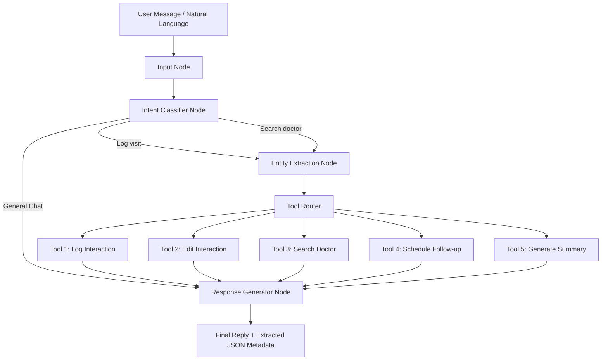

# AI-First CRM – HCP Interaction Module

AI-First CRM is a production-quality full-stack CRM module designed for Medical Representatives (MRs) to log, manage, and analyze interactions with Healthcare Professionals (HCPs) like doctors. It offers two interaction logging modes: a traditional structured form and an **AI conversational chat interface** powered by **LangGraph** and the **Groq API** (`gemma2-9b-it`).

---

## 🏗️ Architecture & Workflow

The system is built on a split Client-Server architecture:
1. **Frontend (SPA)**: React 19 single-page app utilizing Redux Toolkit for state synchronization, React Router for views, Tailwind CSS for visual styling, and Recharts for analytics.
2. **Backend (API)**: FastAPI serving REST endpoints, utilizing SQLAlchemy ORM to manage stateful data.
3. **AI Core (LangGraph & Groq)**: A state graph agent structure to detect intent, extract entities, execute matching CRM tools, and generate responses.



---

## 🛠️ Tech Stack

### Frontend
- **React 19+**
- **Redux Toolkit** (Global state management)
- **React Router v6**
- **Axios** (API Client)
- **Tailwind CSS** (Styling)
- **Lucide React** (Icons)
- **Recharts** (Visual Analytics)

### Backend
- **Python 3.12+**
- **FastAPI**
- **SQLAlchemy ORM**
- **SQLite** (local default) / **PostgreSQL** (preferred)
- **LangGraph** & **LangChain** (AI graph agent)
- **Groq API** (Primary Model: `gemma2-9b-it`)

---

## 📁 Folder Structure

```
.
├── backend
│   ├── app
│   │   ├── api            # API routers (auth, doctors, interactions, followups, chat, summary)
│   │   ├── config         # Configuration settings & environment loader
│   │   ├── database       # Connection initialization & sessions
│   │   ├── models         # SQLAlchemy ORM schemas
│   │   ├── schemas        # Pydantic schemas for data validation
│   │   ├── services       # CRUD operations and JWT Auth services
│   │   ├── agents
│   │   │   ├── langgraph  # StateGraph definition and nodes
│   │   │   ├── tools      # Python executions for the 5 CRM tools
│   │   │   └── prompts    # LLM system prompts
│   │   └── main.py        # FastAPI server entry point
│   ├── Dockerfile
│   └── requirements.txt
├── frontend
│   ├── src
│   │   ├── components     # Global widgets (Toasts, charts)
│   │   ├── layouts        # Navigation wrappers (DashboardLayout)
│   │   ├── pages          # View components (Dashboard, Doctors, Log, History, Followups, Settings)
│   │   ├── redux          # Store configuration and state slices
│   │   ├── services       # Axios client connection
│   │   ├── styles         # CSS configurations
│   │   ├── App.jsx        # Routing configuration
│   │   └── main.jsx       # App bootstrap
│   ├── tailwind.config.js
│   ├── postcss.config.js
│   ├── nginx.conf
│   ├── Dockerfile
│   └── index.html
├── docker-compose.yml
└── README.md
```

---

## ⚙️ Environment Variables

### Backend (`backend/.env`)
- `DATABASE_URL`: Connection string (defaults to SQLite: `sqlite:///./hcp_crm.db`).
- `GROQ_API_KEY`: API Key from Groq Cloud (Mandatory).
- `MODEL_NAME`: Default model (`gemma2-9b-it`).
- `SECRET_KEY`: Signing key for JWT auth.

### Frontend (`frontend/.env`)
- `VITE_API_URL`: Backend API URL (defaults to `http://localhost:8000/api`).

---

## 🚀 Installation & Running

### Option 1: Running with Docker Compose (Recommended)
Launch the database, backend, and frontend inside docker containers:
1. Clone this repository.
2. In the project root, open `.env` or set the variable:
   ```bash
   export GROQ_API_KEY="your_groq_api_key"
   ```
3. Build and launch:
   ```bash
   docker-compose up --build
   ```
4. Access the CRM frontend at `http://localhost`.

---

### Option 2: Running Locally (Development Mode)

#### 1. Setup Backend
1. Navigate to backend folder:
   ```bash
   cd backend
   ```
2. Create and activate a Python virtual environment:
   ```bash
   python3 -m venv venv
   source venv/bin/activate
   ```
3. Install dependencies:
   ```bash
   pip install -r requirements.txt
   ```
4. Copy the environment template and insert your `GROQ_API_KEY`:
   ```bash
   cp .env.example .env
   ```
5. Run the FastAPI development server:
   ```bash
   uvicorn app.main:app --reload --port 8000
   ```

#### 2. Setup Frontend
1. Navigate to frontend folder:
   ```bash
   cd ../frontend
   ```
2. Install npm packages:
   ```bash
   npm install
   ```
3. Start the development server:
   ```bash
   npm run dev
   ```
4. Open your browser to `http://localhost:5173`.

---

## 🔌 API Documentation

FastAPI serves interactive API Swagger documentation at `http://localhost:8000/docs`.

### Key Endpoints
- `POST /api/auth/register`: Register user.
- `POST /api/auth/login`: Authenticate user and get JWT access token.
- `GET /api/doctors`: List doctors (supports `search`, `city`, `specialization` query params).
- `POST /api/doctors`: Create doctor.
- `POST /api/interactions`: Save an interaction.
- `GET /api/interactions`: List interactions (supports filters).
- `POST /api/chat`: Submit natural language input to the LangGraph AI Agent.
- `POST /api/summary`: Manual LLM-powered visit summary generator.
- `GET /api/followup`: View pending follow-up schedules.
- `PUT /api/followup/{id}`: Update follow-up status.

---

## 🔮 Future Improvements
1. **Speech-to-Text Integration**: Adding whisper API support to record voice notes in the chat.
2. **Offline Mode**: Local storage caching of logs for MRs visiting areas with low connectivity.
3. **Advanced Analytics**: Direct PDF report exports summarizing doctor sentiment trends.
